<div align="center">
  
</div>

<br />

```text
~ $ cat about.txt
──────────────────────────────────────────────────
  student · builder · maker  ·  he/him
  i turn rough ideas into things that actually run —
  backends & ai systems by day; graphic design,
  music & art the rest of the time.
──────────────────────────────────────────────────
```


### `// stack`

`Python` &nbsp;`FastAPI` &nbsp;`Celery` &nbsp;`PostgreSQL` &nbsp;`Redis` &nbsp;·&nbsp; `React` &nbsp;`TypeScript` &nbsp;`JavaScript` &nbsp;`Node` &nbsp;`HTML / CSS` &nbsp;·&nbsp; `Docker` &nbsp;`LLMs / RAG`


### `// building`

**Liffy** — AI-powered peer code review. Connects to GitHub, reads your pull requests, and writes structured, senior-engineer-level feedback using RAG&nbsp;+&nbsp;LLMs.
<br />
<sub>`FastAPI` · `Celery` · `React` · `Chroma / pgvector`</sub>


### `// off the keyboard`

`Graphic Design` &nbsp;·&nbsp; `Music / Singing` &nbsp;·&nbsp; `Piano` &nbsp;·&nbsp; `Art`


### `// find me`

<div align="center">

**[ github ](https://github.com/lucenity0)** &nbsp;·&nbsp; **[ email ](mailto:0lucenity@gmail.com)** &nbsp;·&nbsp; **[ linkedin ](https://www.linkedin.com/in/nafees-s-6770712b0/)** &nbsp;·&nbsp; **[ portfolio ](https://me.lucenity.dev)**

</div>

<br />

<div align="center"><sub>designed &amp; built by hand — no templates, no trackers · monochrome + pixels</sub></div>

<!--
  OPTIONAL — monochrome contribution stats.
  This uses a third-party service (github-readme-stats), so it's off by default to keep
  the profile fully self-contained. Uncomment the block below if you want live stats.

<div align="center">
  
</div>
-->
